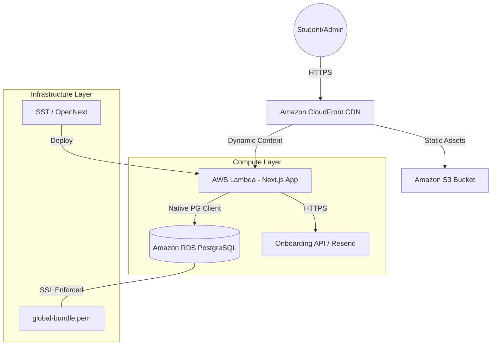

# Architecture Guide: WeThinkCode_ Training Grounds (Native AWS)

This document provides a comprehensive overview of the native AWS architecture implemented for the high-fidelity transition from Supabase. The platform is now optimized for 100% data ownership, security, and scalability within the Amazon Web Services ecosystem.

---

## 🏛️ System Architecture Overview

The system follows a **Cloud-Native Layered Architecture**, leveraging serverless compute and managed database services.



---

## 💾 Core Components

### 1. Database: Amazon RDS (PostgreSQL)
We have pivoted from Supabase to a **Native Amazon RDS** instance. 
- **Platform**: PostgreSQL 16.
- **Security**: Strict SSL enforcement using the `global-bundle.pem` root certificate.
- **Multi-Tenant Schema**: Centralized tables for THREE distinct learning platforms:
    - **SAAIO**: South African AI Opportunity (202 students).
    - **DIP**: Digital Inclusion Program (1,000 students).
    - **WRP**: Work Readiness Program (649 students).

### 2. Compute: AWS Lambda (SST/OpenNext)
The application is deployed using the **SST (Serverless Stack)**, which wraps the Next.js application into AWS Lambda.
- **Edge Delivery**: CloudFront provides global low-latency access.
- **Scaling**: Automatic scaling from zero to handle batch student registrations.
- **Connectivity**: The Lambda environment is bundled with the RDS SSL certificate to ensure secure DB handshakes.

### 3. Messaging: Resend
Email notifications and verification codes are handled via the Resend API, decoupled from the core database logic for improved reliability.

---

## 🔄 Data Integrity & Migration Logic

The migration from Supabase used a **Validation-First** approach to ensure the new RDS environment remained pristine.

### Child-Parent Validation
To prevent "broken links" in the progress tracking system, we implemented a verification loop:
1. **Student Pre-check**: Every `progress` record is checked against the successfully migrated student list.
2. **Orphan Filtering**: Records for legacy test accounts (like `guest` or `eric_test`) that don't have a valid student registration are filtered out, maintaining **Foreign Key Integrity**.

### Schema Normalization
RDS enforces stricter data types than the legacy Supabase REST layer. 
- **UUIDs**: Native UUID types are used for all primary keys.
- **Timestamps**: All timestamps are standardized to `TIMESTAMPTZ` (UTC).
- **JSONB**: Legacy progress maps are stored as high-performance JSONB columns.

---

## 🚀 Deployment Workflow

Deployment is handled via the following command:
```bash
npx sst deploy --stage prod
```

### Build Steps:
1. **Environment Injection**: SST injects `DATABASE_URL` and `RESEND_API_KEY`.
2. **SSL Bundling**: The `global-bundle.pem` is copied into the Lambda build directory.
3. **Optimized Build**: Next.js compiles the serverless-ready chunks.
4. **CloudFormation**: AWS resources (Lambda, S3, CloudFront) are updated.

---

## 🛡️ Security Posture
- **Encryption in Transit**: All DB connections require SSL. Web traffic is TLS 1.3.
- **Secrets Management**: No credentials are stored in code; they are managed via AWS Secrets or environment variables injected at deploy-time.
- **Identity Isolation**: Student and Admin roles are strictly separated at the application level.

---

*Last Updated: April 2026*