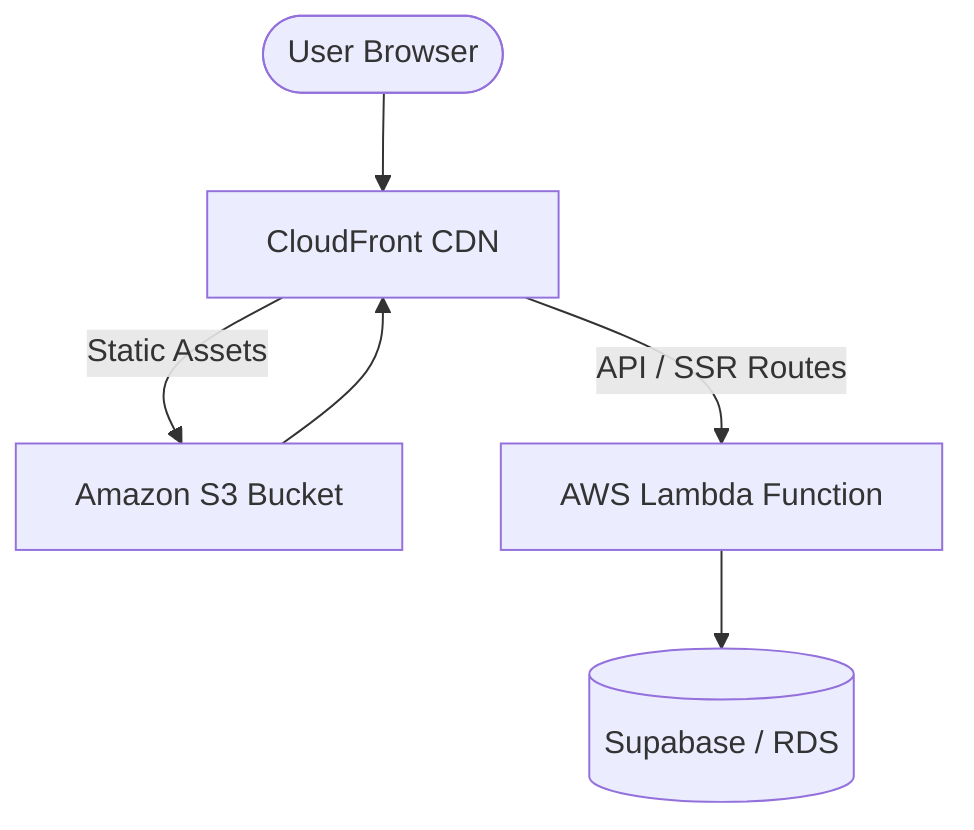

# ☁️ AWS Infrastructure Guide: Next.js on Lambda

This guide provides technical details for deploying the SAAIO Training Grounds Next.js application to AWS using a combination of **Lambda**, **S3**, and **CloudFront**.

## 🏗 Architecture Overview

## 1. Tooling Recommendation (OpenNext / SST)

Since Next.js 16 (App Router) features like API routes and Middleware require a server environment, we recommend using **[OpenNext](https://open-next.js.org/)**. It wraps the Next.js build into a format compatible with AWS Lambda.

### Deployment options:
- **SST (Serverless Stack)**: THE easiest way. It manages the whole stack (S3, CloudFront, Lambda) via CDK.
- **Terraform / OpenNext**: Manual infra management if Wonderby prefers Terraform.

## 2. Infrastructure Components

### Amazon S3 (Static Hosting)
- **Bucket naming**: `saaio-platform-assets`
- **Access**: Private access only. Use **CloudFront Origin Access Control (OAC)** to permit CloudFront to read from the bucket.
- **Content**: The `.next/static` folder and the `public/` directory.

### AWS Lambda (Server Rendering & APIs)
- **Runtime**: Node.js 20.x or higher.
- **Memory**: 1024MB - 2048MB (recommended for image optimization).
- **Architecture**: `arm64` (cheaper and faster).
- **Handler**: Triggered by CloudFront via Lambda Function URL or API Gateway.

### Amazon CloudFront (CDN)
- **Origins**:
    1. S3 bucket (for static files).
    2. Lambda Function (for dynamic rendering and API routes).
- **Behaviors**:
    - Default: Forward to Lambda.
    - `/_next/static/*`: Forward to S3.
    - `/public/*`: Forward to S3.
- **SSL**: Assign an ACM certificate for `saaio.wethinkcode.co.za`.

## 3. Deployment Steps (SST Example)

If Wonderby uses SST, the deployment is as simple as:

1. Install SST: `npm install sst`
2. Initialize: `npx sst init`
3. Deploy: `npx sst deploy --stage prod`

SST will automatically detect the Next.js app and provision the correct S3/Lambda/CloudFront resources.

## 4. Manual Configuration (Optional)

If manual configuration is required:
1. Run `npm run build`.
2. Use **OpenNext** to generate the output: `npx open-next build`.
3. Upload `open-next.output/static` to S3.
4. Create a Lambda function with the contents of `open-next.output/server-function`.
5. Point CloudFront behaviors to the appropriate origins.
